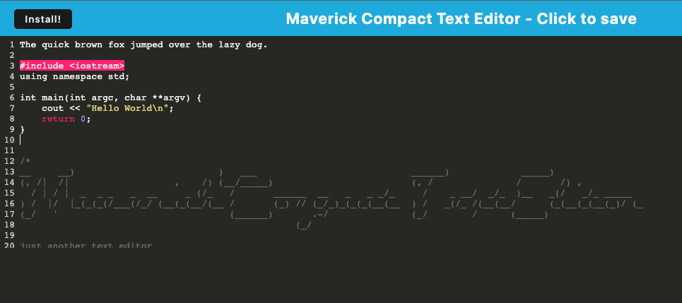

# maverick-compact-text-editor

[](https://opensource.org/licenses/MIT)

## Description

This is a compact text editor. Very useful if you need to write memos, reminders, code or anything that could be remembered.

## Table of Contents

- [Installation](#installation)
- [Usage](#usage)
- [ScreenShot](#screenshot)
- [License](#license)
- [Contributing](#contributing)
- [Tests](#tests)
- [Questions](#questions)

## Installation

To install follow the following instructions:
```sh
git clone https://github.com/rbarbosa51/maverick-compact-text-editor.git
npm run start:dev
```

## Usage

It can be viewed either as a web app or, if you prefer install the app to your physical device. To install run start:dev then go to localhost:3000 and hit the **Install** button

## ScreenShot



## License

This project is covered under the following: MIT License

## Contributing

To contribute to this project submit a GitHub Issue

## Tests

N/A

## Questions

Direct all questions to: rafael.barbosa51@gmail.com

Github User Name: rbarbosa51

Github Profile URL: https://github.com/rbarbosa51